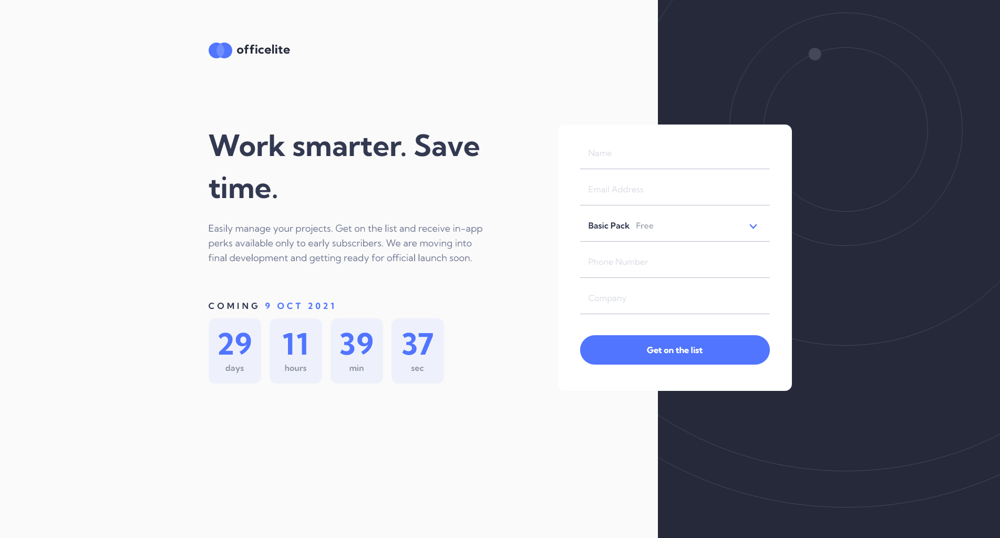

# Frontend Mentor - Officelite coming soon site solution

This is a solution to the [Officelite coming soon site challenge on Frontend Mentor](https://www.frontendmentor.io/challenges/officelite-coming-soon-site-M4DIPNz8g). Frontend Mentor challenges help you improve your coding skills by building realistic projects. 

## Table of contents

- [Overview](#overview)
  - [The challenge](#the-challenge)
  - [Screenshots](#screenshots)
  - [Links](#links)
- [My process](#my-process)
  - [Built with](#built-with)
  - [What I learned](#what-i-learned)
  - [Useful resources](#useful-resources)

## Overview

### The challenge

Users should be able to:

- View the optimal layout for the site depending on their device's screen size
- See hover states for all interactive elements on the page
- See error states when the contact form is submitted if:
  - The `Name` and/or `Email Address` fields are empty
  - The `Email Address` is not formatted correctly
- **Bonus**: See a live countdown timer that ticks down every second
- **Bonus**: See a custom-styled `select` form control in the sign-up form

### Screenshots





### Links

- Solution URL: [https://github.com/zakhi/officelite-coming-soon-site](https://github.com/zakhi/officelite-coming-soon-site)
- Live Site URL: [https://zakhi.github.io/officelite-coming-soon-site/](https://zakhi.github.io/officelite-coming-soon-site/)

## My process

### Built with

- Semantic HTML5 markup
- CSS Grid
- Mobile-first workflow
- Sass


### What I learned

I have used Sass for this project, mainly to create some namespacing and separation of 
the different parts on each page. I found it helping me organize the code better.

For the countdown part, I used [moment.js](https://momentjs.com/). Even though it recommends
using more modern alternatives, I found it the easiest to work with, trying to extract different parts
of a duration:

```javascript
  const timeLeft = moment.duration(arrivalDate.diff(moment()))

  document.getElementById("arrival-date-days").innerText = pad(timeLeft.get("days"))
  document.getElementById("arrival-date-hours").innerText = pad(timeLeft.get("hours"))
  document.getElementById("arrival-date-minutes").innerText = pad(timeLeft.get("minutes"))
  document.getElementById("arrival-date-seconds").innerText = pad(timeLeft.get("seconds"))
```

Creating the custom select box was a nice challenge. This could be very useful for 
future projects. The main reason for not using ```select``` is that it does not support
tags inside the ```option``` tags.

```html
<div class="select">
  <input type="hidden" name="plan" value="free">
  <div class="selected-value">
    Basic Pack <em>Free</em>
  </div>
  <ul class="options">
    <li data-value="free" class="selected">Basic Pack <em>Free</em></li>
    <li data-value="pro">Pro Pack <em>$9.99</em></li>
    <li data-value="ultimate">Ultimate Pack <em>$19.99</em></li>
  </ul>
</div>
```

### Useful resources

- [How to Create a Custom Select Dropdown using HTML, CSS and JavaScript](https://andrejgajdos.com/custom-select-dropdown/) - This was the basis of my custom select box.
- [A Complete Guide to Grid](https://css-tricks.com/snippets/css/complete-guide-grid/) - .A very useful page from CSS Tricks
